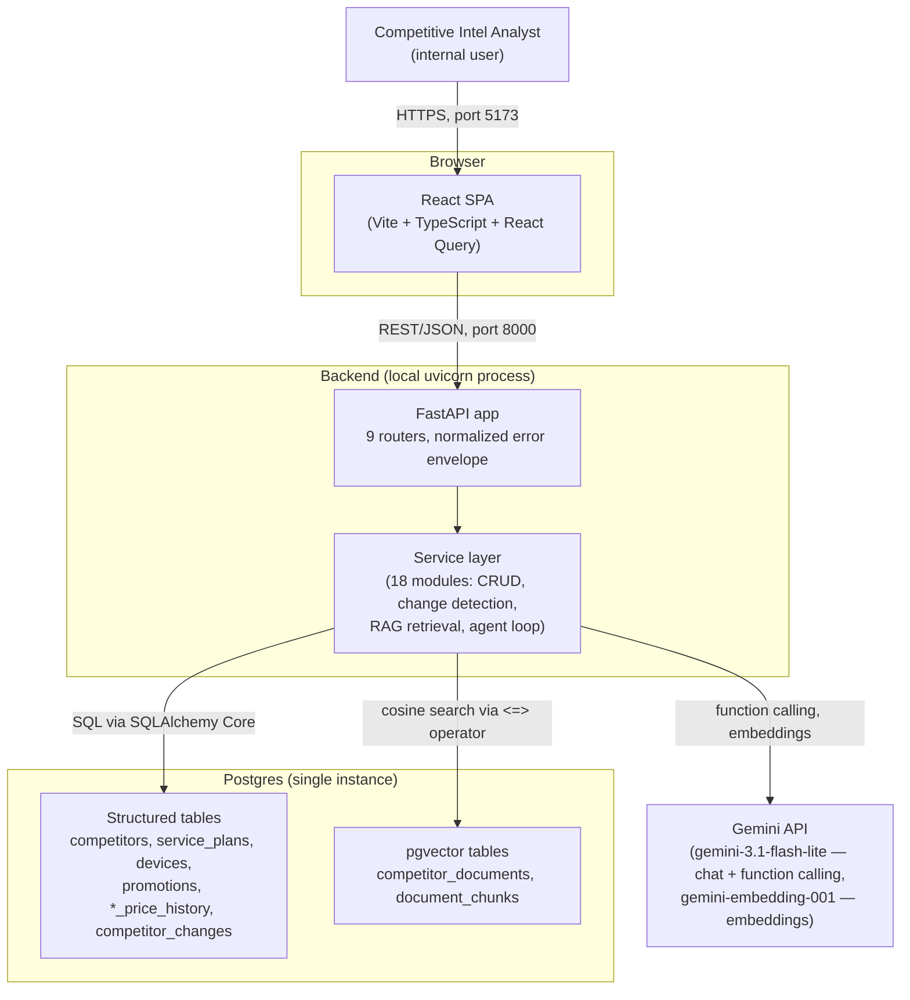
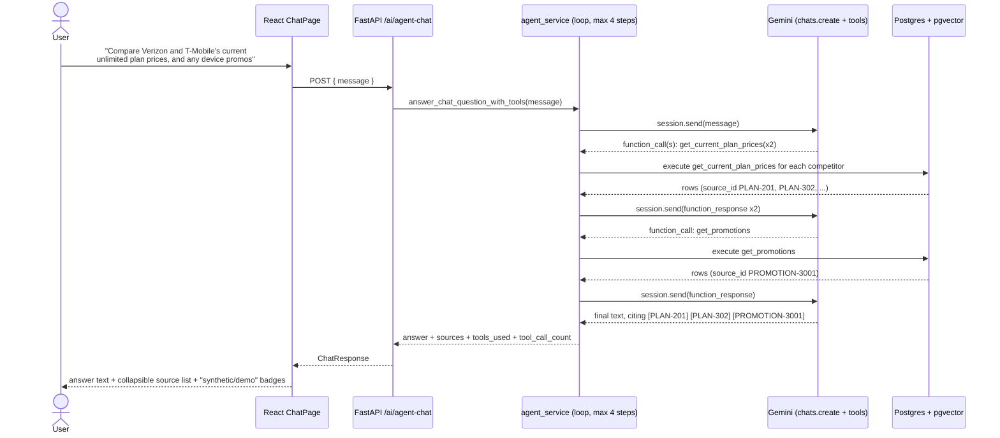

# 01 — System Overview

## What the product does

Boost Mobile's competitive intelligence team needs to know, continuously: what are
T-Mobile and Verizon charging for plans and devices right now, what changed recently, and
what does the fine print on their promotions actually say. Today that's manual web
checking. This prototype turns it into a dashboard plus a chat assistant that can answer
"what changed and why" questions, grounded in data the system actually captured — not in
the LLM's general knowledge of these carriers (which could be stale, wrong, or
hallucinated).

## System context



There is no message queue, no cache layer, no CDN, and no separate vector database — a
deliberate choice to minimize moving parts while the product's core question ("is this
even useful to analysts?") is still unanswered. See [doc 02](02-database-layer.md) and
[doc 09](09-architecture-decision-records.md) for the trade-offs behind that.

## End-to-end request flow: "Ask AI" (the agentic chat path)

This is the path the frontend actually uses (`POST /api/v1/ai/agent-chat`) and the most
architecturally interesting one — the model decides which tools to call, the backend
executes them against real data, and the loop is bounded so it can never hang.



Key property: if the model keeps requesting tools past round 4, the loop stops and
returns a bounded-fallback message instead of looping forever or timing out silently —
see [doc 05](05-llm-agentic-workflow.md) for why 4 and not some other number.

## How the system was actually built (incremental delivery)

The commit history is a clean example of de-risking architecture before layering AI on
top of it — useful to cite in a PM interview as "how I'd sequence an ambiguous AI feature."

```mermaid
gantt
    dateFormat  YYYY-MM-DD
    axisFormat  %b %d
    title Build sequence (Oct 2–3, 2026)
    section Foundation
    Data foundation (schema, seed data)      :done, p1, 2026-10-02, 1d
    Product requirements + roadmap doc       :done, p2, 2026-10-02, 1d
    Deterministic FastAPI backend (no AI)    :done, p3, 2026-10-02, 1d
    React dashboard (read-only, no AI)       :done, p4, 2026-10-02, 1d
    section AI capabilities (added incrementally)
    First LLM capability: AI briefing + eval :done, p5, 2026-10-03, 1d
    Chat (deterministic router) + change detection + alerting :done, p6, 2026-10-03, 1d
    RAG for unstructured documents + eval    :done, p7, 2026-10-03, 1d
    Agentic tool calling + bounded loop + eval :done, p8, 2026-10-03, 1d
    section Not yet started
    Production hardening (CI, containers, auth, monitoring) :active, p9, 2026-10-04, 3d
```

Notice the order: **data model → deterministic CRUD API → dashboard → then AI**, and
within AI: **single-shot generation → RAG → agentic tool use**, each phase shipped with
its own evaluation harness before the next was layered on. This is the "walking skeleton"
pattern — every phase was a working, demoable product, not a partial slice of the final
architecture. See [doc 08](08-pm-concepts-prioritization-tradeoffs.md) for the
prioritization framing of this sequence.

## What's deliberately not built yet

- No Docker/container image, no CI pipeline, no deployment target (local `uvicorn` +
  `vite dev` only).
- No authentication/authorization — anyone with the URL has full read/write access.
- No real competitor-data ingestion (web scraping, feed subscriptions) — all data is
  synthetic/seeded.
- No production observability (structured logging exists for credential redaction, but
  there's no metrics/tracing/alerting stack).

These gaps are the explicit subject of [doc 10](10-architecture-proposal-production-readiness.md),
written as a formal proposal for the next phase.
