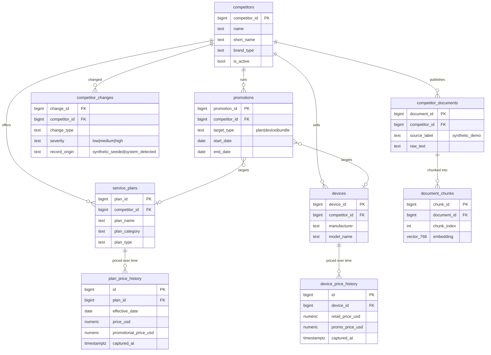

# 02 — Database Layer

## What's there

A single PostgreSQL database holds both the structured competitive facts and the vector
embeddings for RAG — no separate database or vector store.

## Design principle: history is append-only, "current" is derived

`plan_price_history` and `device_price_history` rows are never updated or deleted —
every observation is a new row with a `captured_at` timestamp. "Current price" is not a
stored flag; it's computed at query time (`plan_service.get_current_plan_prices` uses a
`LATERAL` join to pick the newest row per plan). This is a deliberate trade-off:

| | Append-only history (chosen) | Mutable "current price" column |
|---|---|---|
| Auditability | Full price history always reconstructable | Lost unless you also keep history |
| Query cost | Extra `LATERAL`/subquery on every "current" read | Single row read |
| Write complexity | Simple insert, no update logic | Needs careful update + history insert |
| Risk of drift | None — history is the single source of truth | Current flag can desync from history |

For a competitive-intelligence product, **auditability is the product** — "prove to me
Verizon's price changed on this date" is a core use case — so the extra read cost is the
right trade for correctness. This mirrors a pattern a PM should recognize: picking the
data model that matches the product's actual value proposition, not the one that's
fastest to query.

## Why Postgres (and not SQLite, DynamoDB, or a dedicated vector DB)

| Option | Pros | Cons | Verdict |
|---|---|---|---|
| **PostgreSQL + pgvector (chosen)** | One system for structured + vector data; mature SQL, transactions, joins; `pgvector` is a well-supported extension; cheap to run (one small instance or even free-tier managed Postgres) | Exact nearest-neighbor scan (no ANN index) doesn't scale past ~100K vectors without adding `ivfflat`/`hnsw` | Right choice while the document corpus is tiny (3 docs, 17 chunks) and the team wants one database to operate, not two |
| SQLite | Zero ops, file-based, great for a true local-only prototype | No `pgvector` equivalent with the same maturity; no real concurrent-write story; not a credible path to any shared/staging environment | Rejected — the team wanted a real multi-user DB from day one (seen in `.env.example` requiring `POSTGRES_*` vars from commit 1) |
| DynamoDB / other NoSQL | Scales trivially, pay-per-request | Price/device history is inherently relational (joins across plans → history → competitors); modeling that in a key-value store adds complexity for no benefit at this stage | Rejected — the data is relational, not key-value shaped |
| Dedicated vector DB (Pinecone, Weaviate, Qdrant) | Purpose-built ANN indexes, scales to millions of vectors, managed | A second system to run, pay for, and keep in sync with Postgres (dual-write risk); total overkill for 17 chunks | Rejected for now — explicitly revisit if the document corpus grows past the low thousands of chunks (see [ADR-01](09-architecture-decision-records.md#adr-01)) |

**Cost framing for a PM:** at this scale, Postgres+pgvector costs the same as "just
Postgres" — zero incremental infrastructure spend for RAG. A dedicated vector DB would add
a second monthly bill and a second thing to monitor, for a benefit (ANN search speed) that
doesn't matter below roughly 100K vectors. The efficient choice here is "don't pay for
scale you don't have yet," with a clearly documented trigger for when to revisit.

## Migrations

There's no migration framework (Alembic, etc.) — schema changes are plain numbered SQL
files run manually (`01_competitors.sql` ... `09_unstructured_documents.sql`). File `08`
(`08_change_record_origin.sql`) is written idempotently (`ADD COLUMN IF NOT EXISTS`) so it
can be safely re-run against a database that already has the column — a lightweight
stand-in for a real migration tool, appropriate for a single-developer prototype but a
clear gap before multiple environments (staging/prod) exist. See
[doc 10](10-architecture-proposal-production-readiness.md).
