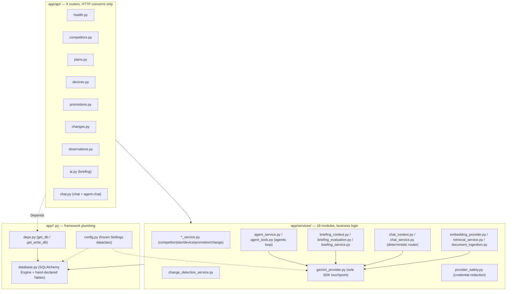

# 03 — Backend API

## Layered architecture



Every router is a thin HTTP adapter: parse query params → call one service function →
map domain errors to HTTP status codes. No business logic lives in the `api/` layer —
`observations.py`, for example, just calls `change_detection_service.submit_*` and turns a
`ValueError` into a 404. This separation is what makes the service layer independently
testable (see [doc 07](07-testing-evaluation-strategy.md)) and reusable — the same
`plan_service`/`device_service` functions back both the plain REST endpoints *and* the
agent's tools (`agent_tools.py` wraps them rather than re-implementing queries).

## Why FastAPI (and not Flask, Django, or Express/Node)

| Option | Pros | Cons | Verdict |
|---|---|---|---|
| **FastAPI (chosen)** | Native async, Pydantic request/response validation out of the box, auto-generated OpenAPI docs, small learning curve, excellent fit for a backend that's mostly "validate → query → call an LLM SDK (I/O-bound)" | Younger ecosystem than Django; no built-in admin/ORM opinions (had to choose SQLAlchemy separately) | Right fit — this backend is I/O-bound (DB + Gemini calls), and Pydantic schemas (`app/models/schemas.py`) double as both validation and frontend-facing API documentation, reducing the frontend/backend contract-drift risk |
| Flask | Simpler, more ubiquitous | No async by default, no built-in validation — would need Flask-RESTX/Marshmallow bolted on to match what FastAPI gives for free | Rejected — would reinvent what FastAPI already provides |
| Django (+ DRF) | Batteries included (admin, ORM, auth) | Heavy for an API-only backend with no admin UI need; ORM would fight the append-only/hand-tuned SQL style needed for pgvector's `<=>` operator | Rejected — too much unused machinery for this scope |
| Node/Express | Same async-friendly I/O-bound story | Would split the team across two languages (Python for RAG/embeddings tooling is the ecosystem default) | Rejected — Python's ML/embedding ecosystem makes a Python backend the lower-friction choice given the RAG requirement |

## Why SQLAlchemy Core, not the ORM

The team declared tables by hand (`database.py`) and writes raw `select()`/`insert()`
statements rather than using SQLAlchemy's declarative ORM classes. This is a deliberate,
slightly unusual choice:

- **pgvector's `<=>` cosine-distance operator** and `CAST(:embedding AS vector)` aren't
  first-class ORM citizens — `retrieval_service.search_chunks` needs raw SQL regardless,
  so standardizing on Core keeps one query style across the whole codebase instead of
  mixing ORM-for-CRUD and raw-SQL-for-vectors.
- The `LATERAL` join used for "current price" (see [doc 02](02-database-layer.md)) is
  also easier to express and reason about in Core than through ORM relationship-loading
  semantics.
- Cost: Core requires writing out full SQL (more verbose than `Model.objects.filter(...)`
  style ORM calls), and the team pays for that with the manually-kept-in-sync TypeScript
  types on the frontend (`lib/types.ts` mirrors every Pydantic schema by hand, no
  codegen). That's an accepted trade for a small, single-developer API surface.

## Error contract

`main.py` installs a custom exception handler so every error — a 404, a 400, an
unexpected 500 — comes back as the same shape:

```json
{ "error": { "code": "NOT_FOUND", "message": "...", "details": null } }
```

This is a small but real product decision: the frontend's `DataState` component (see
[doc 06](06-frontend.md)) can render any failure consistently without per-endpoint
special-casing, and it's cheap insurance against ever leaking a raw stack trace to the
browser — reinforced by `provider_safety.py`, which specifically scrubs API keys and
bearer tokens out of any error text before it's logged or returned (see
[doc 05](05-llm-agentic-workflow.md) and the credential-leak tests in
[doc 07](07-testing-evaluation-strategy.md)).

## Read/write separation at the dependency level

`deps.py` exposes two FastAPI dependencies: `get_db()` (plain connection, for every GET)
and `get_write_db()` (wraps the connection in `engine.begin()`, used only by the
observation-submission endpoints that append history + detect changes + fire an alert in
one atomic unit). This is a lightweight CQRS-flavored split — not full CQRS, just making
the one place that mutates state explicitly transactional, which is exactly where
correctness matters most (a half-written "price changed but no change record" state would
be a real product bug).

## Cost/efficiency framing

Running cost today is effectively one small Postgres instance and one Python process —
FastAPI/uvicorn single-worker is fine for a prototype with no concurrent users. The
efficient-vs-correct trade-off worth flagging for a PM audience: the team chose
**correctness of the data model (normalized tables, append-only history, atomic writes)
over query simplicity**, accepting slightly more complex SQL in exchange for data they can
trust — the right trade for a product whose entire pitch is "trustworthy competitive
facts."
