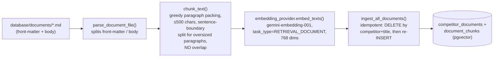
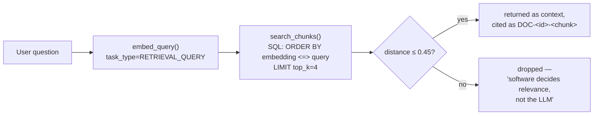

# 04 — RAG Pipeline

## Why RAG exists in this product at all

Structured facts (price, date, device model) live in Postgres and are exact. But
promotion fine print — "this credit applies over 36 months, only on qualifying trade-ins,
only with AutoPay" — is prose, not a column. The product requirement
(`docs/product_requirements.md`) is explicit: *"The LLM must not be treated as the source
of truth for exact competitive facts."* RAG is the mechanism for the LLM to quote real
fine print instead of inventing it, while structured Postgres queries remain the source
of truth for anything numeric.

## Ingestion flow

Run manually via `python -m scripts.ingest_documents` — not triggered automatically on
file change. That's appropriate for a 3-document synthetic corpus; it would need to become
an event-driven or scheduled pipeline once real competitor documents are being scraped
continuously (flagged in [doc 10](10-architecture-proposal-production-readiness.md)).

## Retrieval flow

Two call sites use this same retrieval function: the legacy deterministic chat router
(`chat_context.py`, kept for test comparison) and the live agentic tool
`search_competitor_documents` (`agent_tools.py`) — one retrieval implementation, two
front doors.

## Three key design decisions

**1. Asymmetric embeddings (`RETRIEVAL_DOCUMENT` vs `RETRIEVAL_QUERY`).** Gemini's
embedding model is trained to produce better matches when documents and queries are
embedded with different task-type hints, since a question ("what's the eligibility
window?") and an answer ("customers must enroll within 30 days...") are lexically very
different even when semantically matched. This costs nothing extra — it's a parameter,
not a second model — so it's a pure quality win with zero cost trade-off.

**2. A deterministic relevance gate (`MAX_RELEVANT_DISTANCE = 0.45`), not an LLM
judgment call.** Rather than retrieving top-k and trusting the model to ignore irrelevant
chunks, the code hard-cuts anything beyond a cosine-distance threshold empirically tuned
against this corpus (true matches cluster ~0.23–0.29, off-topic matches ~0.33+, so 0.45 is
a safety margin, not a tight boundary). This is a PM-relevant pattern worth naming
explicitly: **push the "is this relevant" decision into software wherever you can,
and reserve the LLM for judgment calls software genuinely can't make.** It reduces
hallucination risk and is unit-testable in a way "trust the prompt" isn't — see the
RAG test suite in [doc 07](07-testing-evaluation-strategy.md). The documented limitation:
the cutoff is document-level, not sub-topic-level, so a mostly-irrelevant document with
one relevant sentence can still slip through; the system instruction's "say insufficient
data" rule is the backstop for that gap.

**3. No chunk overlap, 500-char chunks, no ANN index.** All three are "right-sized for 3
documents / 17 chunks," not general-purpose RAG defaults:

| Parameter | Chosen value | Why it's fine today | When it would need to change |
|---|---|---|---|
| Chunk size | ≤500 chars, paragraph-aligned | Source documents are short promo-terms pages; no paragraph exceeds a natural chunk | Longer source documents (multi-page PDFs) would need overlap to avoid splitting a fact across a chunk boundary |
| Chunk overlap | None | Nothing to miss across a boundary at this length | Add 10–20% overlap once documents are multi-paragraph and dense |
| Vector index | None (sequential scan) | 17 rows — any index would be slower than a scan | Add `ivfflat`/`hnsw` once the corpus crosses roughly 10K–100K chunks |

## Embedding model choice: Gemini vs. alternatives

| Option | Pros | Cons | Verdict |
|---|---|---|---|
| **gemini-embedding-001 (chosen)** | Same vendor/API key as the chat model — one SDK, one bill, one safety-wrapper (`provider_safety.py`) to maintain; asymmetric retrieval task types built in | Vendor lock-in; quality not benchmarked against alternatives for this specific domain | Right call for a prototype — minimizing integration surface area mattered more than squeezing out marginal retrieval-quality gains |
| OpenAI text-embedding-3 | Strong, widely benchmarked | A second vendor relationship, second API key, second billing line, second safety-review surface, for a corpus of 17 chunks | Rejected — cost of a second vendor isn't justified at this scale |
| Open-source (sentence-transformers, local) | No per-call API cost, no data leaves the network | Needs a model-serving story (GPU or slow CPU inference), one more piece of infra to run and monitor | Rejected for the prototype; worth revisiting only if embedding API costs become material at scale, or if competitor documents become sensitive enough to require fully local processing |

## Cost framing

At this scale (17 chunks, occasional re-ingestion, a handful of questions per session),
embedding API spend is near-zero — this is a case where **the "efficient" choice and the
"simple" choice are the same choice.** The cost conversation only becomes real if the
document corpus grows to thousands of pages scraped continuously; at that point,
re-ingestion should become incremental (only new/changed documents) rather than running
`ingest_all_documents()`'s current idempotent-but-full approach, and embedding cost per
month becomes a line item worth tracking.
