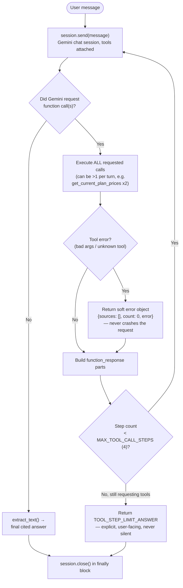
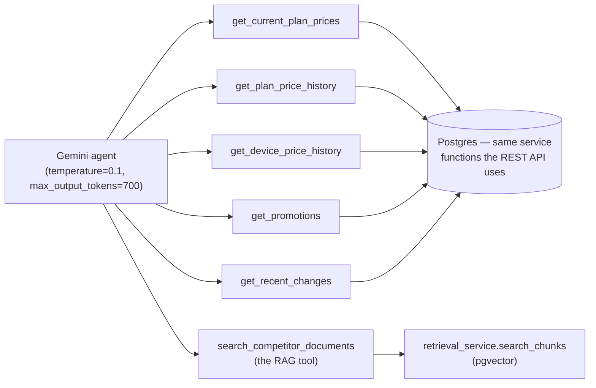

# 05 — LLM / Agentic Workflow

This is the most interesting piece of the system from an "AI-native product" standpoint:
it's not a single prompt-and-response call, it's a bounded agent that decides for itself
which of six tools to call, can call several in one turn, and is architecturally
prevented from running away.

## The bounded agent loop

The loop is a Python `for ... else`: it runs up to 4 rounds, and the `else` branch (which
only fires if the loop completed all 4 iterations without `break`-ing) checks whether the
model is *still* asking for tools — if so, it returns a bounded-fallback answer instead of
either looping forever or crashing. This single piece of control flow is the most heavily
unit-tested logic in the whole backend (see [doc 07](07-testing-evaluation-strategy.md))
because it's the one place an LLM's unpredictable behavior (deciding to call a 5th, 6th,
7th tool) meets a hard product guarantee ("this request will always return within a
bounded number of model round-trips").

**Why 4, specifically?** The comment in the code is candid: it's sized to the hardest
real example the prototype needs to support (a "compare two competitors and explain a
promotion" question needs about 3 tool calls), plus one round of margin — not a formula,
a judgment call grounded in the actual question set the eval harness tests against
(`run_tool_selection_eval.py`, 12/12 on the last run). That's a good pattern to name in an
interview: **set operational limits from observed worst-case product behavior, not from
a theoretical ceiling**, and revisit the number as real usage patterns emerge.

## The six tools

Tool granularity is itself a design decision: one tool per *query shape* the services
already expose, not one mega-tool ("query anything") and not dozens of micro-tools. A
single do-everything tool would push all the reasoning about *what to query* back onto
free-text parameters the model has to get exactly right; dozens of micro-tools would blow
up the function-calling schema and the number of round trips. Six tools mapped 1:1 to the
product's actual entities (plans, devices, promotions, changes, documents) is the
sweet spot for this domain size.

Every tool response includes a `source_id` (`PLAN-201`, `DOC-3-1`, `CHANGE-7`, ...) and
the system instruction requires the model to cite these exactly — which is what lets the
frontend render a trustworthy, clickable "Sources" panel instead of an unverifiable wall
of text (see [doc 06](06-frontend.md)).

## Why Gemini (and not OpenAI or Anthropic) for this build

| Option | Pros | Cons | Verdict |
|---|---|---|---|
| **Gemini 3.1 Flash-Lite (chosen)** | Native function calling with raw JSON-Schema support (`parameters_json_schema`), low per-token cost suited to a multi-round tool loop (each question can cost 2–5 model calls), one SDK also used for embeddings | Smaller/cheaper model tier — may reason less reliably on genuinely hard multi-hop questions than a larger model | Right fit for a prototype whose tool-selection eval explicitly measures whether the cost/capability trade-off holds (it does: 12/12 on the tool-selection eval) |
| GPT-4o / GPT-4o-mini | Very mature function-calling support, strong reasoning | Second vendor, second billing relationship, no embedding-model synergy already in place | Not rejected on merit — just not the vendor this team standardized on; a legitimate reconsideration point if quality issues show up in production |
| Claude (Anthropic) | Strong tool-use and instruction-following | Same second-vendor cost as GPT-4o | Same reasoning as above |

The deciding factor evident in the code isn't "Gemini is categorically best" — it's
**single-vendor simplicity** (one API key, one SDK, one safety-wrapper module, one
embedding+chat relationship) for a prototype where proving the *architecture* (deterministic
tools + bounded loop + citation discipline) mattered more than squeezing the best possible
model. That's a legitimate, cost-aware MVP decision, with model choice flagged as an easy
swap later (it's one `config.py` field).

## Why keep the old deterministic router alongside the new agent?

`chat_context.py`'s keyword-based router (`route_question`) was the *first* chat
implementation (commit `296bdb3`) and is explicitly superseded in the UI by the agentic
tool-calling path (commit `3b50485`, which the frontend now calls exclusively via
`/api/v1/ai/agent-chat`). The old path wasn't deleted — it's kept "for comparison and test
coverage." This is a real engineering-management trade-off worth naming: keeping a
superseded implementation costs maintenance surface (two code paths, two test files) but
buys a regression baseline ("did the new agentic approach get strictly better, or just
different?") during a migration. For a short-lived prototype this is probably excess
caution; for anything closer to production, this would need an explicit deprecation date.

## Safety and grounding, by design, not by prompt alone

- **Credential redaction** (`provider_safety.py`): every place a Gemini error is logged,
  API keys / bearer tokens / `AIza...`-shaped strings are scrubbed before the log line is
  written. Tested explicitly (see [doc 07](07-testing-evaluation-strategy.md)) — the team
  treats "never leak a secret into a log or an HTTP response" as a correctness
  requirement, not a nice-to-have.
- **Mandatory citation** (`AGENT_SYSTEM_INSTRUCTION`): the model is told tool results are
  "the only source of truth" and must cite exact `source_id` values — this is enforced
  partly by prompt and partly by the eval harnesses (`briefing_evaluation.py`,
  `tool_selection_eval.py`) that score citation groundedness after the fact, because a
  prompt instruction alone is not a guarantee.
- **Synthetic-data labeling**: every `competitor_changes` row carries a `record_origin`
  (`synthetic_seeded` vs `system_detected`), and the system instruction requires the model
  to call out synthetic/demo-sourced claims explicitly rather than presenting seeded demo
  data as if it were a real detected market event. This matters product-wise: a
  competitive-intel tool that can't distinguish "we know this happened" from "this is
  placeholder data" would actively mislead a user making a pricing decision.

## Cost/efficiency framing

Each "Ask AI" question costs between 2 and 5 Gemini calls (1 initial + 1 per tool round),
each with `max_output_tokens=700` and a short system instruction — materially cheaper than
a single call to a larger frontier model with a much longer context window stuffed with
"just in case" data. The architecture itself is the cost lever here: by making the model
*ask* for only the data it needs via tools, the system avoids paying to send the model
information it may not use — the multi-round loop trades a few extra cheap round-trips for
not needing a bigger, more expensive model or a bigger context window.
