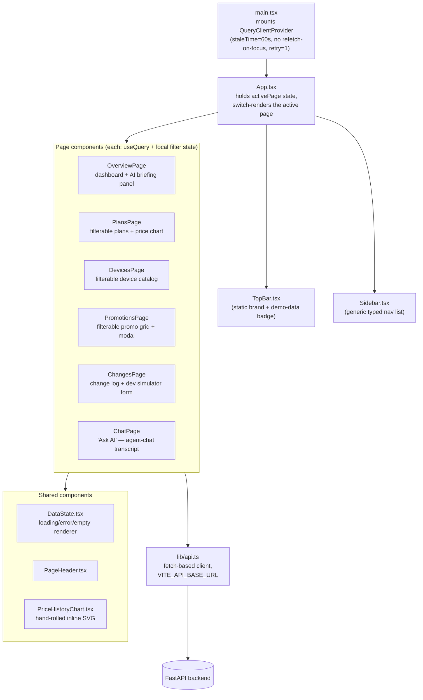

# 06 — Frontend

## Stack

React 18 + TypeScript + Vite, with exactly one data library: `@tanstack/react-query` v5.
No router, no CSS framework, no component library, no global state manager beyond React
Query's cache. This is a noticeably minimal stack for a 6-page dashboard, and that
minimalism is itself a decision worth explaining to a PM audience.

## Decisions and their trade-offs

**No router (React Router, etc.).** `App.tsx` holds `activePage` in a `useState` and
switches between page components; there are no real URLs per page.

| | In-memory state switch (chosen) | React Router |
|---|---|---|
| Setup cost | Zero — one `useState`, one array of nav items | A router dependency, route config, nested layouts |
| Bookmarkable/shareable pages | No — refresh always lands on Overview | Yes |
| Right for 6 fixed pages? | Yes, for now | Overkill until deep-linking (e.g. "link directly to this chat question") is a real requirement |

This is correct for a prototype with no need to share a link to "the Devices page
filtered to Verizon," but it's the first thing to add before any real users rely on
bookmarks or browser back/forward.

**Hand-written CSS, no Tailwind/MUI.** `index.css` is ~1,600 lines of plain CSS with a
CSS Grid `app-shell` layout and a dark theme. The trade-off: no dependency, no utility
class soup, full control over a fairly distinctive dark dashboard look — at the cost of
slower iteration speed than a utility framework would give, and no built-in design-system
consistency enforcement (nothing stops two developers from inventing two different
spacing scales). Reasonable for one person building a cohesive look end to end; the first
thing to reconsider once more than one frontend developer is touching this file.

**Hand-rolled SVG line chart, not a chart library.** `PriceHistoryChart.tsx` computes its
own axis scaling and draws raw SVG `<polyline>`/`<circle>` elements rather than pulling in
Recharts/D3/Chart.js.

| | Hand-rolled SVG (chosen) | Chart library (Recharts etc.) |
|---|---|---|
| Bundle size | Zero added dependency | +tens of KB, more for D3-based libraries |
| Capability | Exactly what two price-history use cases need (standard + promo line, gridlines, legend) | Much broader (tooltips, zoom, many chart types) out of the box |
| Maintenance | Team owns every pixel of scaling/rendering logic | Library owns it, team just configures |

This is the right call *because the product only ever needs one chart shape*. The moment
a second genuinely different visualization is needed (e.g. a stacked comparison or a
heat-map of change frequency), a library starts paying for itself and this trade flips.

**React Query as the only state layer.** Every page fetches directly with `useQuery` /
`useQueries` and mutates with `useMutation`; there's no Redux/Zustand/Context store. This
works because almost all state in this app *is* server state (plans, devices, changes) —
React Query's cache, `staleTime`, and `invalidateQueries` (used by `ChangesPage`'s
"development simulator" to refresh the change list after submitting a synthetic
observation) cover that need completely. A global client-state store would be solving a
problem this app doesn't have.

## API contract: no codegen

`lib/types.ts` hand-mirrors every backend Pydantic schema, and `lib/api.ts` is a thin
`fetch()` wrapper (no axios) pointed at `VITE_API_BASE_URL`. There is no OpenAPI-codegen
step keeping these in sync automatically, even though FastAPI generates an OpenAPI schema
for free. That's a real, named gap: today, a backend schema change silently requires a
manual, easy-to-forget update on the frontend side. Worth flagging as a cheap win (wire up
`openapi-typescript` or similar) before this grows past one developer who can hold the
whole contract in their head.

## Product-visible AI-trust UI patterns

Two choices in `ChatPage.tsx` and `OverviewPage.tsx` are worth calling out as *product*
decisions, not just engineering ones:

- Every AI answer renders a collapsible "Sources" list resolving each tool call to a
  human-readable label (`TOOL_LABELS` map) plus the raw source records — the UI doesn't
  just trust the model's prose, it shows the receipts.
- Synthetic/demo-origin data is visually badged (`"Synthetic / seeded demo"`) everywhere
  it appears, and the AI Briefing panel on Overview shows its own evaluation scores
  (groundedness, factual accuracy, hallucination risk, instruction-following, fact
  coverage) alongside a "Human review required" notice. This is the frontend making the
  product's AI-trust posture visible rather than hiding it behind a confident-sounding
  paragraph — a strong example of "responsible AI" as a UI requirement, not just a backend
  concern, and a good talking point for an AI-native PM interview.
