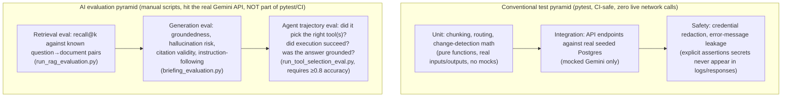

# 07 — Testing & Evaluation Strategy

AI products need two test pyramids, not one: a conventional one for deterministic code,
and a separate evaluation pyramid for anything an LLM touches, because "the code ran
without throwing" says nothing about whether the model's *answer* was any good. This
codebase keeps the two visibly separate, which is itself the lesson worth extracting.

## Why mocked-in-CI, real-in-scripts

The pytest suite (71 tests as of the latest commit) **never makes a live Gemini call** —
every LLM touchpoint is mocked, so the suite is fast, free, deterministic, and safe to
run on every commit. Three separate standalone scripts
(`run_rag_evaluation.py`, `run_tool_selection_eval.py`, `ingest_documents.py`) exist
specifically to validate against the *real* model and real embeddings, run manually by a
human as a validation gate before calling a phase "done" — not wired into CI. This is the
correct split for a product this size: unit-level correctness should never depend on an
external API's availability, cost, or latency, but you still need periodic real-world
proof that model behavior matches what the mocks assume.

## What the team treats as highest-risk (inferred from what's most heavily tested)

1. **Credential leakage.** `test_ai_briefing.py` asserts that API keys and
   `Authorization` headers never appear in logs or HTTP responses, for both expected and
   unexpected provider failures, and that config objects never expose the key via
   `repr()`. This is tested more thoroughly than almost anything else in the suite —
   a clear signal that "never leak a secret" was treated as a release-blocking bar, not a
   nice-to-have.
2. **Hallucination / citation integrity.** `briefing_evaluation.py`'s test coverage
   includes deliberately adversarial cases: unsupported dollar amounts, invalid
   citations, grouped citations (`[F1, F2]`), numeric-format mismatches (`$50` vs
   `$50.00`), and genuinely invented amounts that must be rejected. This is the team
   building its own lightweight, regex-based "LLM-as-judge substitute" because a
   heuristic, deterministic groundedness check is cheaper and more reliable than asking
   a second LLM to judge the first one.
3. **The bounded agent loop's termination guarantee.** `test_agent_tool_calling.py`
   constructs a scripted fake session that requests tools forever and asserts the real
   code still stops at exactly `MAX_TOOL_CALL_STEPS` and returns a user-facing message —
   the single most deliberately-engineered failure mode in the system is also the single
   most deliberately-tested one.
4. **Graceful degradation when AI is unavailable.** Both the briefing and chat paths
   return clean 503/502s (not 500s, not crashes) when the Gemini key is missing or the
   API fails, and RAG falls back to structured-only context rather than erroring when
   embeddings are unavailable. The product keeps working in a reduced form rather than
   going fully down when one dependency misbehaves.
5. **DB write isolation in tests.** `test_competitive_workflows.py` wraps the
   observation-submission tests in a rollback-only transaction fixture, so running the
   test suite never permanently mutates the seeded demo data — a small but telling detail
   about engineering discipline around test hygiene.

## A meta-test worth noting

`test_rag_pipeline.py` includes `test_unstructured_rag_architecture_is_documented`,
which reads `docs/future_unstructured_data.md` and fails if it no longer contains the
words "pgvector," "Structured path," "RAG path," "Hybrid path." It's a test that enforces
*documentation* doesn't silently rot — a nice idea, though in this codebase that same doc
is **already stale** relative to the shipped agentic tool-calling path (it still says "no
automated agentic tool selection yet"). That's a useful, honest example for a PM
interview: automated checks reduce drift, but they only catch what they're written to
catch — the test verifies four keywords exist, not that the document reflects the current
architecture. The fix isn't a bigger test; it's a process habit (update the doc in the
same commit as the feature that invalidates it).

## Mapping eval types to AI capability (PM framework)

| Capability | Eval type | Harness |
|---|---|---|
| Single-shot generation (AI briefing) | Groundedness + hallucination + instruction-following eval | `briefing_evaluation.py` |
| RAG retrieval | Recall@k against known question→document pairs | `rag_evaluation.py` |
| RAG generation | Citation groundedness, unsupported-refusal detection | `rag_evaluation.py` |
| Tool/function selection | Accuracy against labeled cases, ≥0.8 bar to pass | `tool_selection_eval.py` |
| Multi-step agent behavior | Trajectory (tool sequence), execution success, final-answer groundedness | `tool_selection_eval.py` (12 live cases, 12/12 last run) |

This table is close to a textbook answer to "how would you evaluate an AI feature before
shipping it" — each AI capability in this product has a *named, scoped* evaluation method
rather than one generic "does it seem good" check, and the pass bar (0.8 accuracy,
groundedness ≥0.75) is a number, not a vibe.
