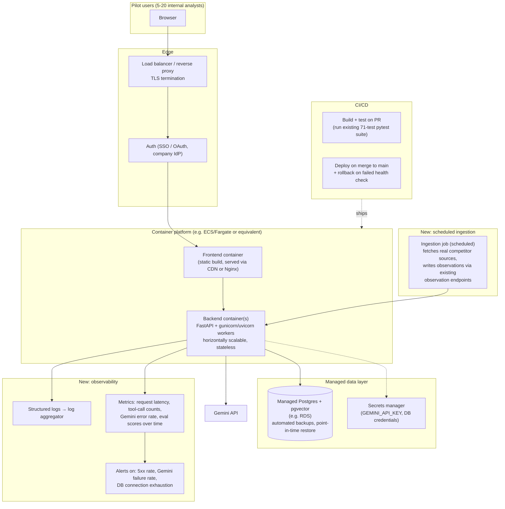

# 10 — Architecture Proposal: Production Readiness (Phase 10)

**Status:** Draft for review
**Author:** Product/Engineering (prototype team)
**Audience:** Engineering leadership, security, SRE
**Related:** [System Overview](01-system-overview.md) · [ADR-06](09-architecture-decision-records.md#adr-06) · [Trade-off log](08-pm-concepts-prioritization-tradeoffs.md)

## 1. Problem statement

Phases 1–9 proved the product hypothesis: a bounded, tool-using AI agent grounded in a
real database can answer competitive-intelligence questions with citable, trustworthy
sources, on top of a clean structured data model with full price-history auditability.
That system runs today as a **local-only, single-user prototype** — no authentication, no
deployment target, no CI, no monitoring, and no real (non-synthetic) data ingestion. It
cannot be handed to a second analyst, let alone the broader competitive-intel team,
without closing those gaps. This proposal scopes what's needed to take the validated
prototype to a small, real pilot audience (5–20 internal users), not to full enterprise
scale.

## 2. Goals

- A second person other than the original builder can run this system without local
  setup.
- Competitive facts and chat history are protected behind authentication; the system is
  not reachable by anyone with the URL.
- A code change can be deployed without manual steps, and a bad deploy can be rolled back
  quickly.
- If the AI agent, the database, or the embedding pipeline degrades, someone finds out
  before a user reports it.
- Real (non-synthetic) competitor data can be ingested on a recurring schedule, not just
  seeded once.

## Non-goals (explicitly out of scope for this phase)

- Scaling to a large vector corpus (pgvector's current sequential-scan approach stays;
  revisit only if the document corpus crosses the ADR-01 trigger).
- Multi-region or high-availability deployment.
- Replacing Gemini with a different model vendor (ADR-02 stands; not a production
  blocker).
- Building a general-purpose web-scraping platform — initial real-data ingestion can
  start with a small, manually curated set of source URLs.

## 3. Proposed architecture

What's genuinely new vs. phase 1–9: a container platform, managed Postgres (vs. a local
instance), a secrets manager, a CI/CD pipeline, an auth layer, an observability stack, and
a scheduled real-data ingestion job. What's **not** changing: the application code itself
— the FastAPI backend, the service layer, the agent loop, and the React frontend all carry
over unmodified. This is infrastructure layered around a validated application, not a
rewrite.

## 4. Rollout plan

| Milestone | Scope | Exit criteria |
|---|---|---|
| M1 — Containerize | Dockerfile for backend + frontend, docker-compose for local parity | Runs identically in a container as it does today locally |
| M2 — CI | GitHub Actions (or equivalent): run the existing pytest suite + frontend type-check on every PR | No merge without green tests |
| M3 — Managed data + secrets | Migrate to managed Postgres, move `GEMINI_API_KEY`/DB creds into a secrets manager | Zero secrets in `.env` files in any deployed environment |
| M4 — Deploy pipeline | CD to one staging environment, then production, with health-check-gated rollback | A bad deploy auto-rolls-back within minutes |
| M5 — Auth | Gate the app behind company SSO | No unauthenticated access to any endpoint |
| M6 — Observability | Structured logs shipped to aggregator, dashboards for latency/error rate/eval scores, alerting on the failure modes in §6 | On-call can detect a Gemini outage or DB issue before a user reports it |
| M7 — Real data pilot | Scheduled ingestion job against a small, manually-curated list of real competitor sources, run alongside the synthetic seed data (clearly labeled, per existing `record_origin`/`source_label` fields) | At least one real, non-synthetic `competitor_changes` record detected and surfaced correctly end-to-end |

M1–M4 can proceed with zero product risk (pure infrastructure, same application code).
M5–M7 are where real product risk enters (real users, real data) and should each get a
go/no-go review.

## 5. Cost estimate (directional, not a quote)

| Item | Prototype (today) | Pilot (proposed) |
|---|---|---|
| Compute | Local process, $0 | 1-2 small container instances, low two-figure $/month |
| Database | Local Postgres, $0 | Small managed Postgres instance (e.g. db.t4g.micro-class), low two-figure $/month |
| LLM/embedding API | Near-zero (prototype usage volumes) | Scales with real usage; at 20 users asking a handful of questions/day, still a low monthly figure given the lightweight model tier chosen in ADR-02 |
| Secrets/CI/observability | $0 | Often bundled free tiers (GitHub Actions, basic log aggregation) at this scale |
| **Total incremental** | — | Roughly in the low hundreds of dollars/month at pilot scale — the architecture's cost-conscious choices (pgvector over a vector DB, a lightweight Gemini tier, no over-provisioned compute) keep this phase cheap relative to the risk it retires |

The explicit point for leadership: **none of phases 1–9's cost-saving architectural
choices need to be undone to go to a pilot.** The jump in cost from prototype to pilot is
almost entirely new infrastructure categories (hosting, managed DB, observability), not a
more expensive version of what already exists.

## 6. Risks and mitigations

| Risk | Likelihood | Impact | Mitigation |
|---|---|---|---|
| Real competitor data is messier than the synthetic seed set (inconsistent formats, missing fields) | High | Medium — could break the deterministic change-detection logic that assumes clean inputs | Pilot the ingestion job against a small, manually curated source list first (per non-goals); add input validation at the ingestion boundary before trusting the existing observation endpoints |
| Gemini API outage or rate-limiting under real concurrent usage | Medium | Medium — chat/briefing features degrade | Already partially handled (503/502 graceful errors, see [doc 07](07-testing-evaluation-strategy.md)); add alerting so degraded mode is visible to the team, not just to users |
| Unauthenticated access before M5 lands | High if deployed before auth | High — any competitive data exposed | Sequence M5 (auth) before any deployment reachable outside a private network; don't let M1-M4 alone justify opening external access |
| Cost creep from Gemini usage at real pilot scale | Low | Low (per §5) | Add per-request token/cost logging as part of M6 observability, so this is measured, not assumed |
| Vendor lock-in to Gemini becomes a blocker later | Low | Medium | Already mitigated structurally by ADR-02 — the integration surface is two files; not a reason to delay this phase |

## 7. Success metrics for this phase

- Zero unauthenticated requests reach the backend post-M5.
- Deploy frequency: at least weekly, with <1 failed-deploy rollback incident requiring
  manual intervention per month.
- Mean time to detect a Gemini or DB outage: under 5 minutes (via alerting, not user
  report).
- At least one real (`record_origin = system_detected`, non-synthetic-source) competitive
  change correctly detected and surfaced to a pilot user within the pilot window.

## 8. Open questions for stakeholders

1. Which company IdP/SSO should gate access (M5), and does the security team have an
   existing pattern for internal-tool auth we should reuse rather than build?
2. What's the actual list of real competitor data sources for the first ingestion pilot
   (M7), and who owns keeping that source list current?
3. What's the acceptable monthly spend ceiling for the pilot, to sanity-check §5 against
   a real budget rather than a directional estimate?
4. Does legal/compliance need to review the system before it touches any real (not
   synthetic) data about competitors, even internally?
